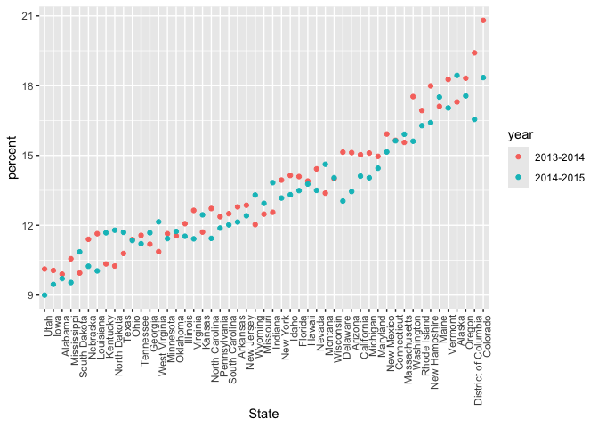

strings and factors
================
2025-10-14

``` r
library(tidyverse)
```

    ## ── Attaching core tidyverse packages ──────────────────────── tidyverse 2.0.0 ──
    ## ✔ dplyr     1.1.4     ✔ readr     2.1.5
    ## ✔ forcats   1.0.0     ✔ stringr   1.5.1
    ## ✔ ggplot2   3.5.2     ✔ tibble    3.3.0
    ## ✔ lubridate 1.9.4     ✔ tidyr     1.3.1
    ## ✔ purrr     1.1.0     
    ## ── Conflicts ────────────────────────────────────────── tidyverse_conflicts() ──
    ## ✖ dplyr::filter() masks stats::filter()
    ## ✖ dplyr::lag()    masks stats::lag()
    ## ℹ Use the conflicted package (<http://conflicted.r-lib.org/>) to force all conflicts to become errors

``` r
library(rvest)
```

    ## 
    ## Attaching package: 'rvest'
    ## 
    ## The following object is masked from 'package:readr':
    ## 
    ##     guess_encoding

``` r
library(p8105.datasets)
```

## Mostly use string vectors

note`str_detect` is case sensitive

``` r
string_vec = c("my", "name", "is", "chelsey")

str_detect(string_vec, "chelsey")
```

    ## [1] FALSE FALSE FALSE  TRUE

``` r
str_detect(string_vec, "e")
```

    ## [1] FALSE  TRUE FALSE  TRUE

``` r
str_replace(string_vec, "chelsey", "Chelsey")
```

    ## [1] "my"      "name"    "is"      "Chelsey"

``` r
str_replace(string_vec, "e", "E")
```

    ## [1] "my"      "namE"    "is"      "chElsey"

``` r
str_replace(string_vec, "e", "")
```

    ## [1] "my"     "nam"    "is"     "chlsey"

``` r
str_remove(string_vec, "e")
```

    ## [1] "my"     "nam"    "is"     "chlsey"

note: `str_detect(string_vec, "i think$ ")` aka looking for “i think” at
the end of sentences note: `str_detect(string_vec, "^i think")` aka
looking for “i think” at beginning of sentences

``` r
string_vec = c(
  "i think we all rule for participating",
  "i think i have been caught",
  "i think this will be quite fun actually",
  "it will be fun, i think"
  )

str_detect(string_vec, "i think")
```

    ## [1] TRUE TRUE TRUE TRUE

``` r
str_detect(string_vec, "^i think")
```

    ## [1]  TRUE  TRUE  TRUE FALSE

``` r
str_detect(string_vec, "i think$ ")
```

    ## [1] FALSE FALSE FALSE FALSE

``` r
str_remove(string_vec, "i think$")
```

    ## [1] "i think we all rule for participating"  
    ## [2] "i think i have been caught"             
    ## [3] "i think this will be quite fun actually"
    ## [4] "it will be fun, "

`[Pp]` looking for anything w/in brackets

``` r
string_vec = c(
  "Time for a Pumpkin Spice Latte!",
  "went to the #pumpkinpatch last weekend",
  "Pumpkin Pie is obviously the best pie",
  "SMASHING PUMPKINS -- LIVE IN CONCERT!!"
  )


str_detect(string_vec, "[Pp]umpkin")
```

    ## [1]  TRUE  TRUE  TRUE FALSE

Let’s get a bit more complicated

``` r
string_vec = c(
  '7th inning stretch',
  '1st half soon to begin. Texas won the toss.',
  'she is 5 feet 4 inches tall',
  '3AM - cant sleep :('
  )

str_detect(string_vec, "[0-9][a-zA-z]")
```

    ## [1]  TRUE  TRUE FALSE  TRUE

note: `.` represents that anything can be in that place note:
`"7\\.1" aka looking for "7.1" becasue`\\ let’s you know you are looking
for a special character

``` r
string_vec = c(
  'Its 7:11 in the evening',
  'want to go to 7-11?',
  'my flight is AA711',
  'NetBios: scanning ip 203.167.114.66'
  )

 str_detect(string_vec, "7\\.1") 
```

    ## [1] FALSE FALSE FALSE  TRUE

## Factors

``` r
vec_sex = factor(c("male", "male", "female", "female"))
vec_sex
```

    ## [1] male   male   female female
    ## Levels: female male

``` r
as.numeric(vec_sex)
```

    ## [1] 2 2 1 1

``` r
vec_sex = fct_inorder(vec_sex)
vec_sex
```

    ## [1] male   male   female female
    ## Levels: male female

## Revisit NSDOH

import NSDUH data from the web

``` r
url = "http://samhda.s3-us-gov-west-1.amazonaws.com/s3fs-public/field-uploads/2k15StateFiles/NSDUHsaeShortTermCHG2015.htm"

drug_use_html = read_html(url)
```

this is an “easy case note:‘slice’ function allows you to take the first
row out

``` r
nsduh_df =
  drug_use_html %>% 
  html_table() %>% 
  first() %>% 
  slice(-1)
```

now do the tidying…. note:
`filter(     !(State %in% c("Total U.S.", "Northeast", "Midwest", "South", "West"))`
means removes where State variable is not in the collection of regions I
stated above

``` r
marj_df = 
  nsduh_df %>% 
  select(-contains("P Value")) %>% 
  pivot_longer(
    -State,
    names_to = "age_year",
    values_to = "percent"
  ) %>% 
  separate(age_year, into = c("age", "year"), sep = "\\(") %>% 
  mutate(
    year = str_remove(year, "\\)"),
    percent = str_remove(percent, "[a-c]$"),
    percent = as.numeric(percent)
  ) %>% 
  filter(
    !(State %in% c("Total U.S.", "Northeast", "Midwest", "South", "West"))
  )
```

Let’s make a quick plot note:
`mutate(State = fct_reorder(State, percent))` means you are reordering
State variable by percent variable

``` r
marj_df %>% 
  filter(age == "12-17") %>%
  mutate(State = fct_reorder(State, percent)) %>% 
  ggplot(aes(x = State, y = percent, color = year)) +
  geom_point() +
  theme(axis.text.x = element_text(angle = 90, hjust=1))
```

<!-- -->

## Restaurant and Inspection

``` r
data("rest_inspec")
```

``` r
rest_inspec %>% 
  group_by(boro, grade) %>% 
  summarise(n = n()) %>% 
  pivot_wider(
    names_from = grade,
    values_from = n
  )
```

    ## `summarise()` has grouped output by 'boro'. You can override using the
    ## `.groups` argument.

    ## # A tibble: 6 × 9
    ## # Groups:   boro [6]
    ##   boro              A     B     C  `NA`     N     P     Z     G
    ##   <chr>         <int> <int> <int> <int> <int> <int> <int> <int>
    ## 1 0                33     9     6    67    NA    NA    NA    NA
    ## 2 Bronx         14071  2611   976 17190   161   236   605    NA
    ## 3 Brooklyn      38896  6423  2194 49825   345   782  1168     2
    ## 4 Manhattan     61675  9107  3600 76581   591   924  1816     3
    ## 5 Queens        36258  5526  1996 44136   350   604  1287    NA
    ## 6 Staten Island  5410   855   248  6315    71    61   116    NA

update the dataset

``` r
rest_inspec =
  rest_inspec %>% 
  filter(
    grade %in% c("A", "B", "C"),
         boro != 0)
```

look for pizza places

``` r
rest_inspec %>% 
  filter(str_detect(dba, "Pizza"))
```

    ## # A tibble: 64 × 26
    ##       camis dba          boro  building street zipcode phone cuisine_description
    ##       <dbl> <chr>        <chr> <chr>    <chr>    <dbl> <chr> <chr>              
    ##  1 50075286 Jr's Pizza … Manh… 95       MACDO…   10012 2122… Pizza              
    ##  2 50075286 Jr's Pizza … Manh… 95       MACDO…   10012 2122… Pizza              
    ##  3 50075286 Jr's Pizza … Manh… 95       MACDO…   10012 2122… Pizza              
    ##  4 50018453 Radio City … Manh… 142      W 49T…   10019 2128… Pizza/Italian      
    ##  5 50018453 Radio City … Manh… 142      W 49T…   10019 2128… Pizza/Italian      
    ##  6 50018453 Radio City … Manh… 142      W 49T…   10019 2128… Pizza/Italian      
    ##  7 50018453 Radio City … Manh… 142      W 49T…   10019 2128… Pizza/Italian      
    ##  8 50018453 Radio City … Manh… 142      W 49T…   10019 2128… Pizza/Italian      
    ##  9 50018453 Radio City … Manh… 142      W 49T…   10019 2128… Pizza/Italian      
    ## 10 50018453 Radio City … Manh… 142      W 49T…   10019 2128… Pizza/Italian      
    ## # ℹ 54 more rows
    ## # ℹ 18 more variables: inspection_date <dttm>, action <chr>,
    ## #   violation_code <chr>, violation_description <chr>, critical_flag <chr>,
    ## #   score <dbl>, record_date <dttm>, inspection_type <chr>, latitude <dbl>,
    ## #   longitude <dbl>, community_board <dbl>, council_district <chr>,
    ## #   census_tract <chr>, bin <dbl>, bbl <dbl>, nta <chr>, grade <chr>,
    ## #   grade_date <dttm>

``` r
rest_inspec %>% 
  filter(str_detect(dba, "[Pp][Ii][Zz][Zz][Aa]")) %>% 
  group_by(boro, grade) %>% 
  summarise(n = n()) %>% 
  pivot_wider(
    names_from = grade,
    values_from = n
  )
```

    ## `summarise()` has grouped output by 'boro'. You can override using the
    ## `.groups` argument.

    ## # A tibble: 5 × 4
    ## # Groups:   boro [5]
    ##   boro              A     B     C
    ##   <chr>         <int> <int> <int>
    ## 1 Bronx          1201   261    98
    ## 2 Brooklyn       1919   291    95
    ## 3 Manhattan      2091   400    96
    ## 4 Queens         1695   239    78
    ## 5 Staten Island   328    60    15

let’s make this table a plot instead

``` r
rest_inspec %>% 
  filter(str_detect(dba, "[Pp][Ii][Zz][Zz][Aa]")) %>% 
  ggplot(aes(x = boro, fill = grade)) +
  geom_bar()
```

<!-- -->

``` r
rest_inspec %>% 
  filter(str_detect(dba, "[Pp][Ii][Zz][Zz][Aa]")) %>% 
  mutate(boro = fct_infreq(boro)) %>% 
  ggplot(aes(x = boro, fill = grade)) +
  geom_bar()
```

<!-- -->

``` r
rest_inspec %>% 
  filter(str_detect(dba, "[Pp][Ii][Zz][Zz][Aa]")) %>% 
  mutate(boro = fct_infreq(boro),
         boro = fct_recode(boro, "The City" = "Manhattan")) %>% 
  ggplot(aes(x = boro, fill = grade)) +
  geom_bar()
```

<!-- -->
